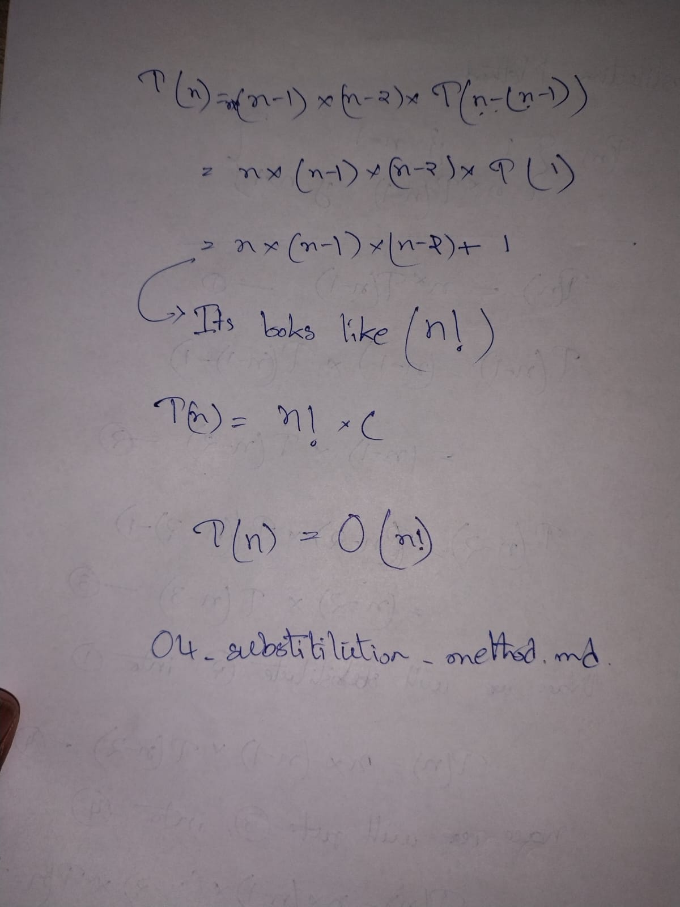

---
---
---

We are solving this **recurrence relation using the Substitution Method**:

\[
T(n) = n \cdot T(n-1)
\]

---

## Step 0: Understand what is given

* The time for input size `n`
* Depends on time for size `n-1`
* Multiplied by `n`

This is **not** a divide-and-conquer case.
So **Substitution Method is the correct choice**.

---

## Step 1: Write the recurrence clearly

\[
T(n) = n \cdot T(n-1)
\]

We will now **expand (substitute)** step by step.

---

## Step 2: First substitution (expand once)

We know:

\[
T(n-1) = (n-1) \cdot T(n-2)
\]

Now substitute this into the original equation:

\[
T(n) = n \cdot [(n-1) \cdot T(n-2)]
\]

Simplify:

\[
T(n) = n (n-1) T(n-2)
\]

✅ **No step skipped**

---

## Step 3: Second substitution (expand again)

Now expand ( T(n-2) ):

\[
T(n-2) = (n-2) \cdot T(n-3)
\]

Substitute:

\[
T(n) = n (n-1) [(n-2) \cdot T(n-3)]
\]

Simplify:

\[
T(n) = n (n-1) (n-2) T(n-3)
\]

---

## Step 4: Continue the pattern (still substitution)

After `k` substitutions, the pattern becomes:

\[
T(n) = n (n-1) (n-2) \dots (n-k+1) \cdot T(n-k)
\]

This is **still substitution**, just written compactly.

---

## Step 5: Reach the base case

Recursion stops when:

\[
n - k = 1 \Rightarrow k = n - 1
\]

So substitute ( k = n-1 ):

\[
T(n) = n (n-1) (n-2) \dots 2 \cdot T(1)
\]

---

## Step 6: Use base case value

Assume:

\[
T(1) = c \quad \text{(constant)}
\]

So:

\[
T(n) = c \cdot n (n-1) (n-2) \dots 2
\]

---

## Step 7: Recognize the factorial

\[
n (n-1) (n-2) \dots 2 \cdot 1 = n!
\]

We are missing `1`, but multiplying by `1` changes nothing.

So:

\[
T(n) = c \cdot n!
\]

---

## Step 8: Drop constants (Big-O rule)

In time complexity analysis:

* Constants are ignored

So:

\[
T(n) = O(n!)
\]

---

## ✅ Final Answer

\[
\boxed{T(n) = O(n!)}
\]

---

## One-line intuition (VERY IMPORTANT)

> Each recursive step multiplies the cost by `n`, so the total work grows like a factorial.

---

## Quick recap of what we did (no new info)

1. Wrote the recurrence
2. Substituted ( T(n-1) )
3. Substituted again
4. Continued until base case
5. Recognized factorial
6. Applied Big-O rule
