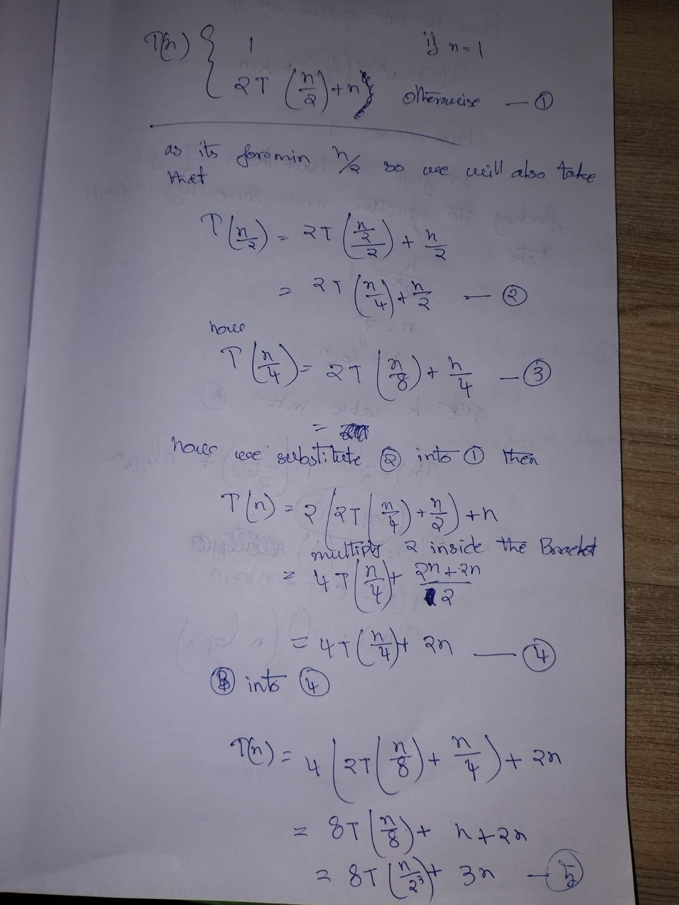
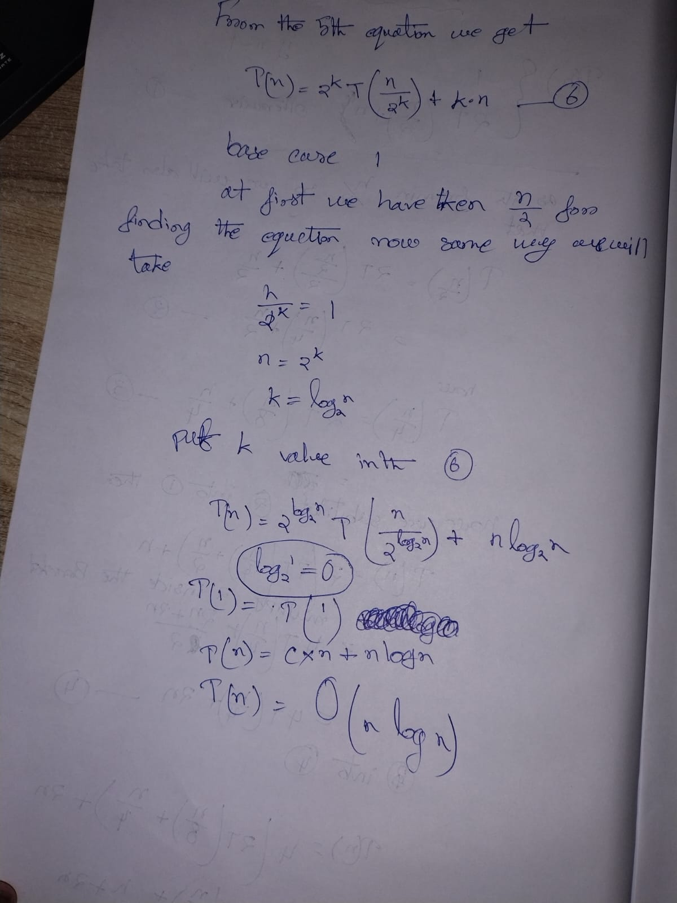

---
---
---

We are using **Substitution Method** for:

\[
T(n) = 2T\left(\frac{n}{2}\right) + n
\]

---

## Step 0: What we are doing

* This is a **divide and conquer** recurrence
* We will **expand (substitute)** again and again
* Until we reach the **base case**

No Master Theorem, no shortcuts.

---

## Step 1: Write the recurrence clearly

\[
T(n) = 2T\left(\frac{n}{2}\right) + n
\]

---

## Step 2: First substitution

We expand ( T(n/2) ).

From the same recurrence:

\[
T\left(\frac{n}{2}\right)
= 2T\left(\frac{n}{4}\right) + \frac{n}{2}
\]

Now substitute this into Step 1:

\[
T(n) = 2\left[2T\left(\frac{n}{4}\right) + \frac{n}{2}\right] + n
\]

---

## Step 3: Simplify carefully

Multiply `2` inside the bracket:

\[
T(n) = 4T\left(\frac{n}{4}\right) + n + n
\]

\[
T(n) = 4T\left(\frac{n}{4}\right) + 2n
\]

---

## Step 4: Second substitution

Now expand ( T(n/4) ):

\[
T\left(\frac{n}{4}\right)
\= 2T\left(\frac{n}{8}\right) + \frac{n}{4}
]

Substitute into Step 3:

\[
T(n) = 4\left[2T\left(\frac{n}{8}\right) + \frac{n}{4}\right] + 2n
\]

---

## Step 5: Simplify again

Multiply `4`:

\[
T(n) = 8T\left(\frac{n}{8}\right) + n + 2n
\]

\[
T(n) = 8T\left(\frac{n}{8}\right) + 3n
\]

---

## Step 6: Observe the pattern (VERY IMPORTANT)

After `k` substitutions, we get:

\[
T(n) = 2^k T\left(\frac{n}{2^k}\right) + kn
\]

This pattern comes directly from the expansions above.

No guessing — just observation.

---

## Step 7: Reach the base case

Recursion stops when:

\[
\frac{n}{2^k} = 1
\]

Solve for `k`:

\[
n = 2^k
\]

\[
k = \log_2 n
\]

---

## Step 8: Substitute base case

Put ( k = \log_2 n ) into Step 6:

\[
T(n) = 2^{\log_2 n} T(1) + n \log_2 n
\]

---

## Step 9: Simplify powers

\[
2^{\log_2 n} = n
\]

So:

\[
T(n) = nT(1) + n\log_2 n
\]

---

## Step 10: Use base case value

Assume:

\[
T(1) = c
\]

So:

\[
T(n) = cn + n\log n
\]

---

## Step 11: Apply Big-O rule

* Drop constants
* Keep highest growth term

\[
\boxed{T(n) = O(n\log n)}
\]

---

## ✅ Final Answer

\[
\boxed{T(n) = O(n\log n)}
\]

---

## One-line intuition (lock this in)

> Each level does `n` work, and there are `log n` levels.
