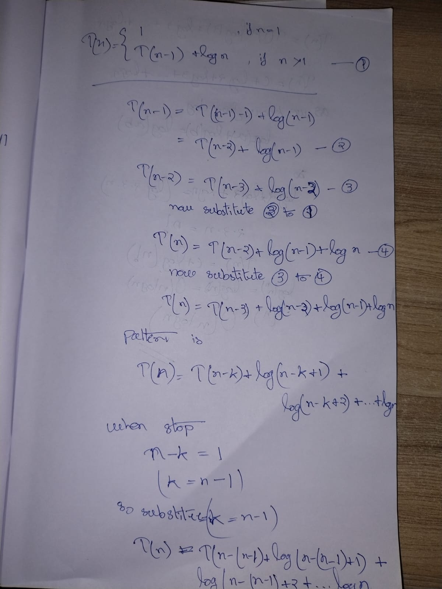
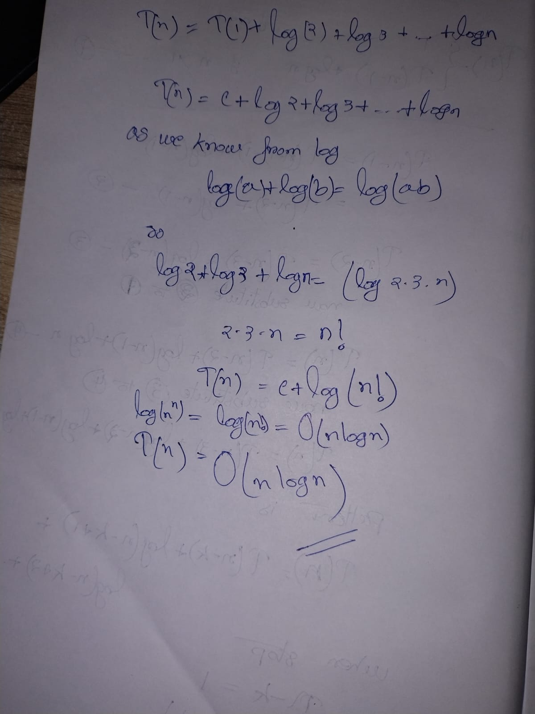

---
---
---

## Problem

We are given the recurrence relation:

\[
T(n) = T(n-1) + \log n
\]

Assume a **base case**:

\[
T(1) = c \quad (\text{some constant})
\]

---

## Step 1: What this recurrence means (intuition)

* The time to solve problem of size `n`
* equals the time to solve size `n-1`
* **plus extra work of** `log n`

So every time `n` decreases by 1, we **add (\log n)** work.

---

## Step 2: Start substitution (expand once)

Substitute `T(n-1)` using the same recurrence formula.

\[
T(n-1) = T(n-2) + \log(n-1)
\]

Now plug this into the original equation:

\[
\begin{aligned}
T(n)
&= T(n-1) + \log n \
&= \big[T(n-2) + \log(n-1)\big] + \log n \
&= T(n-2) + \log(n-1) + \log n
\end{aligned}
\]

---

## Step 3: Expand again (second substitution)

Now substitute `T(n-2)`:

\[
T(n-2) = T(n-3) + \log(n-2)
\]

Plug it in:

\[
\begin{aligned}
T(n)
&= T(n-3) + \log(n-2) + \log(n-1) + \log n
\end{aligned}
\]

---

## Step 4: Identify the pattern

After expanding **k times**, we get:

\[
\begin{aligned}
T(n)
&= T(n-k) + \log(n-k+1) + \log(n-k+2) + \dots + \log n
\end{aligned}
\]

Each step:

* reduces `T` by 1
* adds one logarithmic term

---

## Step 5: Reach the base case

We stop when:

\[
n - k = 1 \Rightarrow k = n - 1
\]

So substitute (k = n-1):

\[
\begin{aligned}
T(n)
&= T(1) + \log 2 + \log 3 + \log 4 + \dots + \log n
\end{aligned}
\]

Replace `T(1)` with constant `c`:

\[
T(n) = c + \log 2 + \log 3 + \dots + \log n
\]

---

## Step 6: Combine logarithms

We use the log rule:

\[
\log a + \log b = \log(ab)
\]

So:

\[
\log 2 + \log 3 + \dots + \log n
= \log(2 \cdot 3 \cdot 4 \cdots n)
\]

That product is:

\[
2 \cdot 3 \cdot 4 \cdots n = n!
\]

So:

\[
T(n) = c + \log(n!)
\]

---

## Step 7: Approximate (\log(n!))

Using a known approximation:

\[
\log(n!) = \Theta(n \log n)
\]

(From Stirling’s approximation)

Constants don’t matter in Big-O, so:

\[
T(n) = \Theta(n \log n)
\]

---

## ✅ Final Answer

\[
\boxed{T(n) = \Theta(n \log n)}
\]

---

## One-line intuition (to remember forever)

> We add (\log n) **n times**, so total work is
> (\log 1 + \log 2 + \dots + \log n = \Theta(n \log n))
