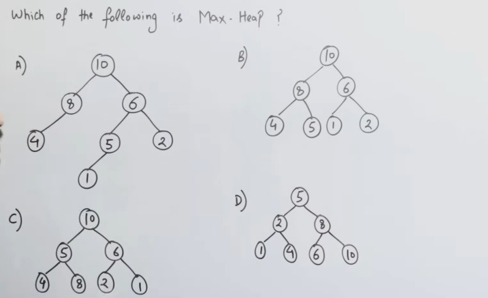

# 🌲 Introduction to Heap Tree (Beginner Friendly)

---

## 1️⃣ What is a Heap Tree? (Very Basic)

A **Heap** is a **special type of Binary Tree** that follows **TWO RULES**:

### 🔹 Rule 1: Shape Rule

> Heap must be a **Complete Binary Tree**

📌 That means:

* All levels fully filled
* Last level filled **left to right**

---

### 🔹 Rule 2: Heap Property

Depending on type:

* **Max Heap**
* **Min Heap**

---

## 2️⃣ Why Do We Need Heap?

Heap is used when we want:

* Fast access to **maximum** or **minimum** element

💡 Applications:

* Priority Queue
* CPU Scheduling
* Dijkstra Algorithm
* Heap Sort

---

## 3️⃣ Max Heap (Simple)

### 🔹 Definition

In a **Max Heap**:

> **Parent node ≥ its children**

📌 Maximum element is always at the **root**

---

### 🔹 Example (Max Heap)

```
        50
       /  \
     30    40
    / \    /
  10  20  35
```

Check:

* 50 ≥ 30, 40 ✔
* 30 ≥ 10, 20 ✔
* 40 ≥ 35 ✔

✔ Shape is complete
✔ Heap property satisfied

---

### ❌ Not a Max Heap

```
        40
       /  \
     50    30
```

❌ Parent < child

---

## 4️⃣ Min Heap (Simple)

### 🔹 Definition

In a **Min Heap**:

> **Parent node ≤ its children**

📌 Minimum element is always at the **root**

---

### 🔹 Example (Min Heap)

```
        10
       /  \
     20    15
    / \    /
  30  40  25
```

✔ 10 ≤ 20, 15
✔ 20 ≤ 30, 40
✔ 15 ≤ 25

---

### ❌ Not a Min Heap

```
        10
       /
      5
```

❌ Parent > child

---

## 5️⃣ Heap vs BST (VERY IMPORTANT)

🚨 Many beginners confuse Heap with BST

| Heap                    | BST                      |
| ----------------------- | ------------------------ |
| Complete Binary Tree    | No shape restriction     |
| Parent ≥ children (Max) | Left < Root < Right      |
| Root is max/min         | Root not necessarily max |
| Fast get max/min        | Fast search              |

---

## 6️⃣ Heap Is NOT Sorted ❌

🚨 This is BIG confusion

### Max Heap Example

```
        50
       /  \
     30    40
```

Is it sorted?
❌ NO (30 < 40 but on left)

Heap only guarantees:

* Parent–child relation
* NOT left–right order

---

## 7️⃣ Array Representation of Heap (Easy Trick)

Heap is stored in **array**, not pointer tree.

### 🔹 Index Rules (0-based indexing)

For node at index `i`:

```
Left child  = 2i + 1
Right child = 2i + 2
Parent      = (i - 1) / 2
```

---

### 🔹 Example (Max Heap)

Tree:

```
        50
       /  \
     30    40
    / \
  10  20
```

Array:

```
Index:  0  1  2  3  4
Value: [50,30,40,10,20]
```

---

## 8️⃣ Why Heap MUST be Complete?

Because:

* Complete tree → perfect array mapping
* No wasted space
* Easy index calculation

---

## 9️⃣ Summary Table (Beginner Exam Ready)

| Property    | Max Heap             | Min Heap             |
| ----------- | -------------------- | -------------------- |
| Root        | Maximum              | Minimum              |
| Shape       | Complete Binary Tree | Complete Binary Tree |
| Parent Rule | ≥ children           | ≤ children           |
| Used in     | Priority Queue       | Priority Queue       |

---

## 🔟 One-Line Memory Trick 🧠

* **Heap = Complete + Parent Rule**
* **Max Heap → max at top**
* **Min Heap → min at top**
* **Heap ≠ sorted tree**

---
---
---
---
---
---



Let’s solve this **slowly and systematically**, so your confusion about **Heap** goes away permanently.

---

## 🔑 First, LOCK the rules of a **Max Heap**

A tree is a **Max Heap** **ONLY IF BOTH rules are satisfied**:

### ✅ Rule 1: Shape Rule

> It must be a **Complete Binary Tree**

* All levels filled
* Last level filled **left to right**
* **No gaps in between**

---

### ✅ Rule 2: Heap Property

> **Every parent ≥ its children**

---

Now we’ll **check option by option** using ONLY these two rules.

---

## ✅ Option A

```
        10
       /  \
      8    6
     /    / \
    4    5   2
        /
       1
```

### 🔍 Check Rule 2 (Heap property)

* 10 ≥ 8, 6 ✔
* 8 ≥ 4 ✔
* 6 ≥ 5, 2 ✔
* 5 ≥ 1 ✔

👉 Heap property looks OK.

### 🔍 Check Rule 1 (Complete tree)

Look at the **last level**:

* Node `8` has **only left child (4)** ✔
* Node `6` has **both children**
* BUT node `5` has a child `1` while nodes before are missing children ❌

❌ **Gap problem** → NOT complete

### ❌ Option A is NOT a Max Heap

---

## ✅ Option B

```
        10
       /  \
      8    6
     / \  / \
    4  5 1   2
```

### 🔍 Rule 1: Shape

* All levels filled ✔
* Last level filled left to right ✔
  ✔ **Complete Binary Tree**

### 🔍 Rule 2: Heap Property

* 10 ≥ 8, 6 ✔
* 8 ≥ 4, 5 ✔
* 6 ≥ 1, 2 ✔

✔ **Heap property satisfied**

---

### ✅ Option B IS a Max Heap ✅✅

---

## ✅ Option C

```
        10
       /  \
      5    6
     / \  / \
    4  8 2   1
```

### 🔍 Rule 2: Heap property

Check node `5`:

* 5 ≥ 4 ✔
* 5 ≥ 8 ❌❌

Parent is **smaller than child**

❌ Heap property violated

---

### ❌ Option C is NOT a Max Heap

---

## ✅ Option D

```
        5
       / \
      2   8
     / \  / \
    1  4 6  10
```

### 🔍 Rule 2: Heap property

* Root is `5`
* Right child is `8` ❌

❌ Parent < child

---

### ❌ Option D is NOT a Max Heap

---

## 🎯 FINAL ANSWER

### ✅ **Correct Max Heap: OPTION B**

---

## 🧠 One-Glance Exam Trick (VERY IMPORTANT)

When you see such questions, do this **order**:

1️⃣ **Check root**

* Max Heap → root must be **largest**

2️⃣ **Check completeness**

* Look for gaps (left must be filled first)

3️⃣ **Check parent ≥ children**

If **ANY ONE fails → NOT a heap**
