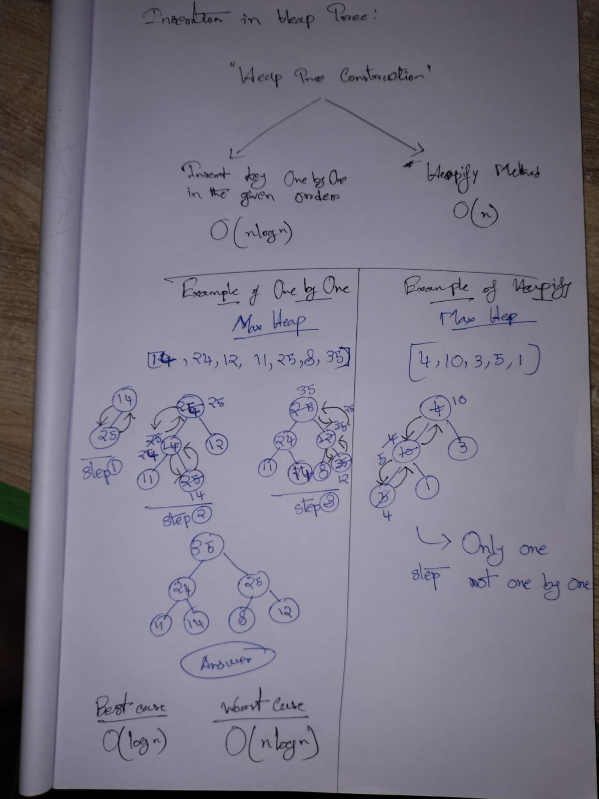

# 🌳 MAX HEAP CREATION — TWO METHODS (FROM BEGINNING)

We will use the **same input** for both methods so you can clearly see the difference.

### Input elements

```
4, 10, 3, 5, 1
```

---

# PART 1️⃣ — ONE-BY-ONE INSERTION METHOD

(**Top-Down Approach**)

---

## 🔹 Idea (Very Important)

* Start with an **empty heap**
* Insert elements **one at a time**
* After each insertion:

  * Fix heap using **swap with parent**
  * This is called **bubble-up / percolate-up**

---

## 🔹 Heap Rules (Max Heap)

1. Complete Binary Tree
2. Parent ≥ children

---

## 🔹 Step-by-Step Insertion

### 🔸 Insert `4`

Heap:

```
4
```

Array:

```
[4]
```

✔ Only one node → already heap

---

### 🔸 Insert `10`

Inserted at next free position:

```
   4
  /
10
```

Compare with parent:

* 10 > 4 → ❌ violates max-heap

👉 **Swap**

After swap:

```
   10
  /
 4
```

Array:

```
[10, 4]
```

---

### 🔸 Insert `3`

Insert at end:

```
    10
   /  \
  4    3
```

Compare:

* 3 < 10 → ✔ no swap

Array:

```
[10, 4, 3]
```

---

### 🔸 Insert `5`

Insert:

```
      10
     /  \
    4    3
   /
  5
```

Compare with parent:

* 5 > 4 → ❌ swap

After swap:

```
      10
     /  \
    5    3
   /
  4
```

Compare again:

* 5 < 10 → ✔ stop

Array:

```
[10, 5, 3, 4]
```

---

### 🔸 Insert `1`

Insert:

```
      10
     /  \
    5    3
   / \
  4   1
```

Compare:

* 1 < 5 → ✔ no swap

Final Max Heap:

```
      10
     /  \
    5    3
   / \
  4   1
```

Final array:

```
[10, 5, 3, 4, 1]
```

---

## ⏱️ TIME COMPLEXITY — ONE-BY-ONE METHOD

### 🔹 Cost of ONE insertion

* Worst case: element moves from **leaf → root**
* Height of heap = `log n`

\[
T_{\text{insert}} = O(\log n)
\]

---

### 🔹 Cost for `n` elements

\[
T(n) = n \times O(\log n) = O(n \log n)
\]

✔ This is **how you calculate it**

---

# PART 2️⃣ — HEAPIFY METHOD (BUILD-HEAP)

(**Bottom-Up Approach**)

---

## 🔹 Idea (Very Important)

* Start with **all elements already in array**
* Treat array as **complete binary tree**
* Fix heap **from bottom non-leaf node to root**
* Uses **heapify-down**

---

## 🔹 Given Array

```
[4, 10, 3, 5, 1]
```

Tree:

```
        4
       / \
     10   3
    / \
   5   1
```

---

## 🔹 Step 1: Find last non-leaf node

For `n = 5`:
\[
\left\lfloor \frac{n}{2} \right\rfloor - 1 = 1
\]

We heapify **index 1 → index 0**

---

## 🔹 Step 2: Heapify at index 1 (value = 10)

Children:

* Left = 5
* Right = 1

Check:

```
10 ≥ 5 and 1 → ✔
```

👉 No swap

---

## 🔹 Step 3: Heapify at index 0 (value = 4)

Children:

* Left = 10
* Right = 3

Largest child = 10

Check:

```
4 < 10 → ❌
```

👉 **Swap**

After swap:

```
        10
       /  \
      4    3
     / \
    5   1
```

Array:

```
[10, 4, 3, 5, 1]
```

---

### 🔹 Continue heapify-down at index 1

Node = 4
Children = 5 and 1

Largest child = 5

Check:

```
4 < 5 → ❌
```

👉 **Swap**

After swap:

```
        10
       /  \
      5    3
     / \
    4   1
```

Array:

```
[10, 5, 3, 4, 1]
```

✔ Heap property restored

---

## ⏱️ TIME COMPLEXITY — HEAPIFY METHOD

### 🔹 Key observation

* Leaf nodes → **no work**
* Nodes near bottom → **1 swap**
* Very few nodes near root → **log n swaps**

---

### 🔹 Exact Calculation

| Level  | Nodes | Max Work per Node |
| ------ | ----- | ----------------- |
| Leaves | n/2   | 0                 |
| Above  | n/4   | 1                 |
| Above  | n/8   | 2                 |
| Root   | 1     | log n             |

Total work:

\[
\frac{n}{4} \cdot 1 + \frac{n}{8} \cdot 2 + \cdots + 1 \cdot \log n
= O(n)
\]

✔ This is **why heapify is O(n)**

---

# 🔥 FINAL COMPARISON (LOCK THIS)

| Method               | How          | Time           |
| -------------------- | ------------ | -------------- |
| One-by-one insertion | Bubble UP    | **O(n log n)** |
| Heapify (build-heap) | Heapify DOWN | **O(n)**       |

---

## 🧠 ONE LINE TO REMEMBER FOREVER

> **Insertion builds heap slowly**
> **Heapify builds heap smartly**

---
---
---
---
---
---
---
---
---
---
---

**❌ NO — heapify is NOT the same as one-by-one insertion.**
They **both create a heap**, but they work **differently** and have **different time complexities**.


## 🔑 The Core Difference (One Line)

> **Insertion** fixes the heap **while adding each element**
> **Heapify** fixes the heap **after all elements already exist**

---

## 1️⃣ One-by-One Insertion (Top-Down)

### What happens?

* Start with **empty heap**
* Insert elements **one at a time**
* Each insert **bubbles UP**

### Example (Max Heap)

Insert: `4, 10, 3, 5, 1`

```
Insert 4  → [4]
Insert 10 → [10, 4]
Insert 3  → [10, 4, 3]
Insert 5  → [10, 5, 3, 4]
Insert 1  → [10, 5, 3, 4, 1]
```

### Time

* Each insert = `O(log n)`
* Total = **O(n log n)**

---

## 2️⃣ Heapify / Build-Heap (Bottom-Up)

### What happens?

* Start with **full array**
* Treat it as a **complete binary tree**
* Fix heap **from last non-leaf node to root**
* Uses **heapify-down**

### Same input:

```
[4, 10, 3, 5, 1]
```

Heapify steps (short):

* Heapify index 1 → OK
* Heapify index 0 → swaps → done

Final heap:

```
[10, 5, 3, 4, 1]
```

### Time

* **O(n)**

---

## 🚨 Why They Are NOT the Same

| Point     | One-by-One        | Heapify                           |
| --------- | ----------------- | --------------------------------- |
| Start     | Empty heap        | Full array                        |
| Direction | Bottom → up       | Bottom → up (but fixing subtrees) |
| Operation | Bubble UP         | Heapify DOWN                      |
| Time      | **O(n log n)**    | **O(n)**                          |
| Used in   | Dynamic insertion | Fast heap creation                |

---

## 🧠 Very Important Exam Note

> **Both may produce the SAME final heap**,
> but **the PROCESS and TIME are different**.

So:

* Same **result** ❌ does NOT mean same **algorithm**

---

## 🧩 One Sentence to Remember Forever

> **Insertion maintains the heap as you grow it**
> **Heapify repairs the heap after it already exists**
