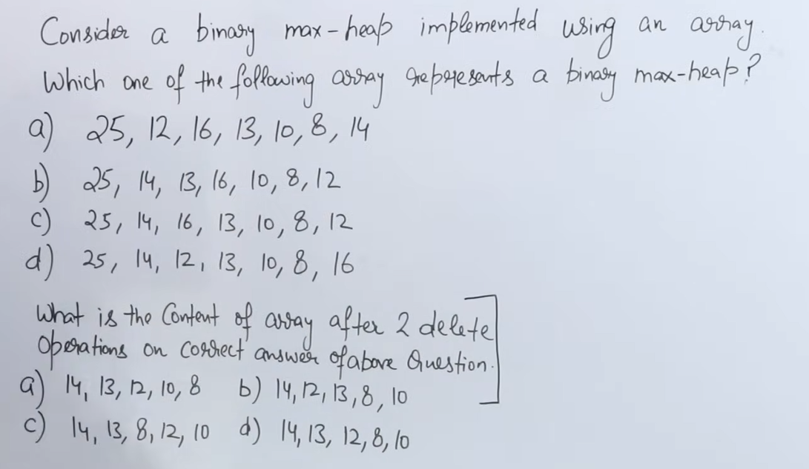

---
---
---


# 🔹 QUESTION (Rewritten Clearly)

### Part 1

> **Which of the following arrays represents a Binary Max Heap?**

Options:

A) `25, 12, 16, 13, 10, 8, 14`
B) `25, 14, 13, 16, 10, 8, 12`
C) `25, 14, 16, 13, 10, 8, 12`
D) `25, 14, 12, 13, 10, 8, 16`

---

### Part 2

> **After performing 2 delete operations on the correct heap found above, what will be the final array?**

Options given for part 2.

---

# ✅ FIRST: What does “array represents a binary max-heap” mean?

When heap is stored in an **array**, it must satisfy:

### ✔ Rule 1: Complete Binary Tree

(Automatically satisfied by array form)

### ✔ Rule 2: Max-Heap Property

For every index `i`:

[
A[i] \ge A[2i+1] \quad \text{and} \quad A[i] \ge A[2i+2]
]

(0-based indexing)

---

# PART 1️⃣ — CHECK EACH OPTION

We only check **parent ≥ children**.

---

## 🔍 Option A

```
[25, 12, 16, 13, 10, 8, 14]
```

Check index-wise:

* 25 ≥ 12, 16 ✔
* 12 ≥ 13 ❌ (violated)

❌ **Not a max heap**

---

## 🔍 Option B

```
[25, 14, 13, 16, 10, 8, 12]
```

* 25 ≥ 14, 13 ✔
* 14 ≥ 16 ❌

❌ **Not a max heap**

---

## 🔍 Option C

```
[25, 14, 16, 13, 10, 8, 12]
```

Check all parents:

* 25 ≥ 14, 16 ✔
* 14 ≥ 13, 10 ✔
* 16 ≥ 8, 12 ✔

✅ **All conditions satisfied**

✔ **This IS a Binary Max Heap**

---

## 🔍 Option D

```
[25, 14, 12, 13, 10, 8, 16]
```

* 12 ≥ 16 ❌

❌ **Not a max heap**

---

## ✅ ANSWER OF PART 1

[
\boxed{\text{Option C}}
]

---

# PART 2️⃣ — WHAT IS THIS PART ASKING?

This line causes confusion 👇

> **“What is the content of array after 2 delete operations on correct answer?”**

### 🔑 Meaning (Very Important)

* **Delete operation in a Max Heap = delete MAX element**
* MAX element is always at **root**
* So **2 delete operations** means:
  👉 **Delete the root TWO TIMES**, one after another

---

# 🔹 START WITH CORRECT MAX HEAP

Initial heap (Option C):

```
[25, 14, 16, 13, 10, 8, 12]
```

Tree form:

```
        25
       /  \
     14    16
    / \    / \
  13 10   8  12
```

---

# 🗑️ DELETE OPERATION #1 (Delete 25)

### Step 1: Replace root with last element (12)

```
[12, 14, 16, 13, 10, 8]
```

### Step 2: Heapify DOWN

Compare 12 with children (14, 16)
Largest = 16 → swap

```
[16, 14, 12, 13, 10, 8]
```

Compare 12 with children (8) → OK

✔ Heap restored

---

### Heap after 1st delete:

```
[16, 14, 12, 13, 10, 8]
```

---

# 🗑️ DELETE OPERATION #2 (Delete 16)

### Step 1: Replace root with last element (8)

```
[8, 14, 12, 13, 10]
```

### Step 2: Heapify DOWN

Compare 8 with children (14, 12)
Largest = 14 → swap

```
[14, 8, 12, 13, 10]
```

Compare 8 with children (13, 10)
Largest = 13 → swap

```
[14, 13, 12, 8, 10]
```

✔ Heap restored

---

# ✅ FINAL ARRAY AFTER 2 DELETES

\[
\boxed{[14, 13, 12, 8, 10]}
\]

---

# 🎯 MATCH WITH OPTIONS (PART 2)

Correct option:

```
14, 13, 12, 8, 10
```

---

# 🧠 FINAL ANSWERS (LOCK IT)

### ✔ Part 1 Answer:

\[
\boxed{\text{Option C}}
\]

### ✔ Part 2 Answer:

\[
\boxed{14, 13, 12, 8, 10}
\]

---

# 🔑 ONE-LINE MEMORY TRICK

* **Delete in Max Heap = delete root**
* **Two deletes = delete max twice**
* **Always heapify DOWN after delete**
