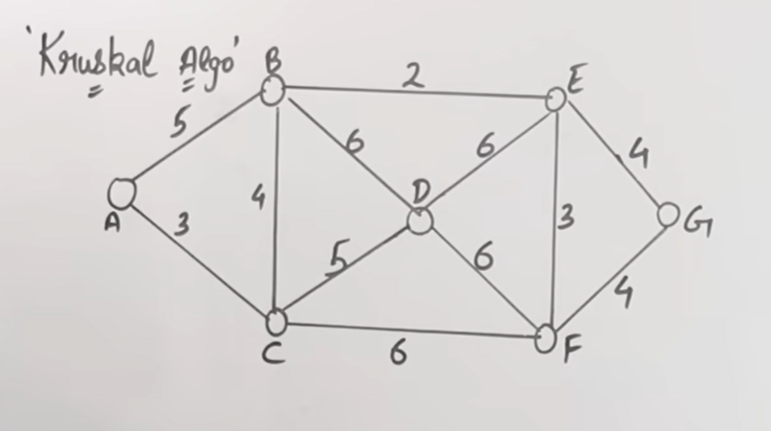

# 🌳 Kruskal’s Algorithm (Beginner Explanation)

## 1️⃣ First: What problem does Kruskal solve?

You are given:

* A **connected graph**
* Each edge has a **weight (cost)**

👉 **Goal**:
 
> Connect all vertices with **minimum total cost**,
> **no cycles**, using **V − 1 edges**

This result is called a **Minimum Spanning Tree (MST)**.

---

## 2️⃣ Core idea of Kruskal’s Algorithm

Kruskal is a **Greedy Algorithm**.

### Greedy Rule:

> **Always pick the smallest weight edge first**,
> **but never form a cycle**.

That’s it.
Everything in Kruskal revolves around this rule.

---

## 3️⃣ When is Kruskal especially useful?

✔ Sparse graphs
✔ When edges are easier to sort
✔ Easy to understand & implement
✔ Used widely in DAA exams

---

## 4️⃣ What does Kruskal need?

To apply Kruskal, we need:

1. **Edge list**
2. **Sorting edges by weight**
3. **Cycle detection mechanism**

   * Usually done using **Disjoint Set / Union-Find**

---

## 5️⃣ Kruskal Algorithm – Step-by-Step Procedure

### Step 1

Sort all edges in **ascending order of weight**

---

### Step 2

Start with:

* An empty set `MST = { }`

---

### Step 3

Pick the **smallest edge**:

* If it **does NOT create a cycle** → add it to MST
* If it **creates a cycle** → skip it

---

### Step 4

Repeat Step 3 until:

```
Number of edges in MST = V − 1
```

---

## 6️⃣ Example (Fully Worked, Very Important)

### Given graph

Vertices:

```
A, B, C, D
```

Edges with weights:

```
A-B = 1
B-C = 2
A-C = 3
B-D = 4
C-D = 5
```

---

## 7️⃣ Step 1: Sort edges by weight

```
A-B = 1
B-C = 2
A-C = 3
B-D = 4
C-D = 5
```

---

## 8️⃣ Step 2: Start picking edges

### Pick 1: A-B (1)

```
A --- B
```

✔ No cycle
✔ Add to MST

Cost so far = **1**

---

### Pick 2: B-C (2)

```
A --- B --- C
```

✔ No cycle
✔ Add to MST

Cost so far = **3**

---

### Pick 3: A-C (3)

If we add it:

```
A --- B
 \     |
  \    |
    C
```

❌ Cycle formed
❌ Skip this edge

---

### Pick 4: B-D (4)

```
A --- B --- C
      |
      D
```

✔ No cycle
✔ Add to MST

Cost so far = **7**

---

### MST Complete

Edges chosen = **3 = V − 1**

---

## 9️⃣ Final Minimum Spanning Tree

### MST edges:

```
A-B (1)
B-C (2)
B-D (4)
```

### Total cost:

```
7
```

---

## 🔟 Why Kruskal avoids cycles (intuition)

* A **tree cannot contain cycles**
* Adding an edge between two **already connected vertices** creates a cycle
* Kruskal checks this before adding edges

This is why **Union-Find** is used internally.

---

## 1️⃣1️⃣ Union-Find idea (simple intuition)

* Initially, each vertex is in its **own set**
* When an edge is added → merge sets
* If two vertices are already in the **same set**, adding edge forms a cycle

---

## 1️⃣2️⃣ Time Complexity

Let:

* `V` = vertices
* `E` = edges

### Sorting edges:

```
O(E log E)
```

### Union-Find operations:

```
Almost O(1)
```

### Total:

```
O(E log E)
```

---

## 1️⃣3️⃣ Kruskal vs Prim (Quick difference)

| Feature        | Kruskal         | Prim           |
| -------------- | --------------- | -------------- |
| Approach       | Edge-based      | Vertex-based   |
| Data structure | Edge list + DSU | Priority Queue |
| Best for       | Sparse graphs   | Dense graphs   |
| Cycle handling | Explicit        | Implicit       |

---

## 1️⃣4️⃣ One-line exam definition

> **Kruskal’s Algorithm** is a greedy algorithm that finds the minimum spanning tree by repeatedly selecting the smallest weight edge that does not form a cycle.

---

## 1️⃣5️⃣ Key points to remember (EXAM GOLD)

✔ Sort edges by weight
✔ Pick smallest edge
✔ Reject cycles
✔ Stop at `V − 1` edges
✔ Greedy + Union-Find

---
---
---
---
---
---
---





