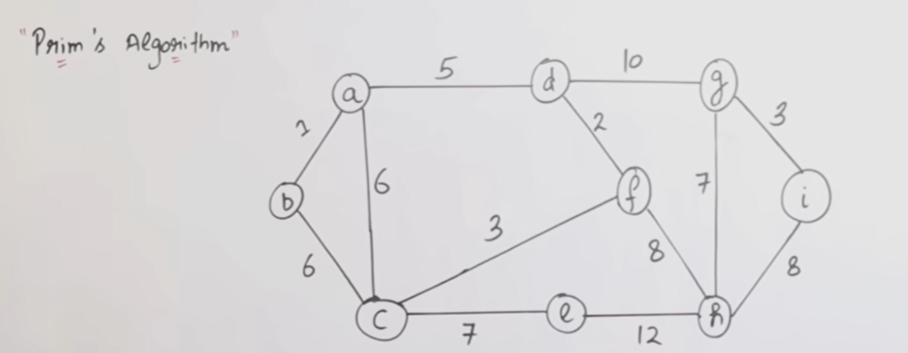

# 🌳 Minimum Cost Spanning Tree (MCST / MST) – Recap (very short)

You already know:

A **Minimum Spanning Tree (MST)**:

* Connects **all vertices**
* Has **no cycles**
* Uses **V − 1 edges**
* Has **minimum total cost**

Now the question is:

👉 **How do we construct it step by step?**

That’s where **Prim’s Algorithm** comes in.

---

# 🌱 Prim’s Algorithm — Beginner Explanation

## 1️⃣ What is Prim’s Algorithm?

> **Prim’s Algorithm** is a **greedy algorithm** that builds a **Minimum Spanning Tree** by:
>
> **Starting from one vertex and growing the tree one edge at a time**, always choosing the **cheapest edge that connects the tree to a new vertex**.

---

## 2️⃣ Big idea (VERY IMPORTANT)

### Kruskal thinks like this:

> “Pick the cheapest edges anywhere in the graph.”

### Prim thinks like this:

> “I already have a tree — now attach the **nearest new vertex** to it.”

So:

* **Prim = vertex-based**
* **Kruskal = edge-based**

---

## 3️⃣ When do we use Prim’s Algorithm?

Prim is very good when:

* Graph is **dense** (many edges)
* You want to **grow the tree gradually**
* Using **priority queue / min-heap**

---

## 4️⃣ Core greedy rule of Prim

> **At every step, choose the minimum weight edge that connects**
>
> * one vertex **inside the tree**
> * to one vertex **outside the tree**

No cycle check is needed explicitly.

---

## 5️⃣ What data do we track in Prim?

Prim maintains:

1. A set `T` → vertices already included in MST
2. A list of candidate edges → edges crossing from `T` to outside
3. Always choose the **minimum cost** such edge

---

## 6️⃣ Prim’s Algorithm — Step-by-Step Procedure

### Step 1

Choose **any starting vertex**

(Prim can start anywhere — result cost stays same)

---

### Step 2

Add the starting vertex to MST set `T`

---

### Step 3

Among all edges that:

* start from `T`
* go to a vertex not in `T`

👉 Pick the **smallest weight edge**

---

### Step 4

Add:

* that edge
* the new vertex

---

### Step 5

Repeat Steps 3–4 until:

```
All vertices are included
(or edges = V − 1)
```

---

## 7️⃣ Simple Example (no algorithm confusion)

### Vertices:

```
A, B, C, D
```

### Edges:

```
A-B = 1
A-C = 3
B-C = 2
B-D = 4
C-D = 5
```

---

### Start Prim from A

#### Step 1:

```
T = {A}
```

Edges from A:

```
A-B (1), A-C (3)
```

Pick smallest → **A-B (1)**

```
T = {A, B}
Cost = 1
```

---

#### Step 2:

Edges from {A,B} to outside:

```
A-C (3)
B-C (2)
B-D (4)
```

Pick smallest → **B-C (2)**

```
T = {A, B, C}
Cost = 3
```

---

#### Step 3:

Edges from {A,B,C} to outside:

```
B-D (4)
C-D (5)
```

Pick smallest → **B-D (4)**

```
T = {A, B, C, D}
Cost = 7
```

---

### MST complete (V−1 edges)

---

## 8️⃣ Why Prim never creates a cycle?

Because:

* It always connects a **new vertex**
* A cycle needs two vertices already inside the tree

So:

> **Cycle avoidance is automatic in Prim**

---

## 9️⃣ Time Complexity of Prim

Depends on implementation:

| Data Structure            | Time       |
| ------------------------- | ---------- |
| Adjacency Matrix          | O(V²)      |
| Min-Heap + Adjacency List | O(E log V) |

---

# ⚔️ Prim’s vs Kruskal — Proper Comparison

| Feature        | Prim’s Algorithm        | Kruskal’s Algorithm    |
| -------------- | ----------------------- | ---------------------- |
| Approach       | Vertex-based            | Edge-based             |
| Starts from    | One vertex              | No start vertex        |
| Growth         | Grows one tree          | Builds forest → tree   |
| Edge selection | Cheapest edge from tree | Cheapest edge globally |
| Cycle check    | Not required explicitly | Required (Union-Find)  |
| Best for       | Dense graphs            | Sparse graphs          |
| Data structure | Priority Queue          | Sorting + Union-Find   |

---

## 🔑 Intuition difference (VERY IMPORTANT)

### Prim:

> “I already built something — now what is the **cheapest way to extend it**?”

### Kruskal:

> “Among all edges, what is the **cheapest safe edge** I can take?”

---

## 🔟 Exam-ready one-line definitions

**Prim’s Algorithm**:

> A greedy algorithm that finds the minimum spanning tree by starting from a vertex and repeatedly adding the minimum cost edge that connects the tree to a new vertex.

**Kruskal’s Algorithm**:

> A greedy algorithm that finds the minimum spanning tree by selecting edges in increasing order of weight while avoiding cycles.

---

## 1️⃣1️⃣ Common beginner mistakes (avoid these)

❌ Thinking Prim depends on start vertex
❌ Thinking Prim and Kruskal give different MST cost
❌ Forgetting `V − 1` edge rule
❌ Mixing edge-based and vertex-based logic

---

## 🧠 Final mental model (remember this)

* **Prim** → *Grow the tree*
* **Kruskal** → *Pick cheapest edges*
* Both → *Greedy*
* Both → *Same minimum cost*

---
---
---
---
---
---
---
---
---
---




---

# 🌱 Prim’s Algorithm — FULL STEP-BY-STEP SOLUTION

## 1️⃣ Read the graph (from the image)

### Vertices:

```
a, b, c, d, e, f, g, h, i
```

Total vertices:

```
V = 9
```

👉 MST must have:

```
V − 1 = 8 edges
```

---

### Edges with weights (from the diagram)

```
a–b = 1
a–c = 6
a–d = 5

b–c = 6

c–e = 7
c–f = 3

d–f = 2
d–g = 10

f–h = 8
f–g = 7

g–i = 3

h–i = 8
e–h = 12
```

---

## 2️⃣ Prim’s Algorithm rule (recap)

> At each step, choose the **minimum weight edge** that connects
> **a vertex inside the tree** to **a vertex outside the tree**.

No explicit cycle checking needed.

---

## 3️⃣ Choose a starting vertex

Prim can start anywhere.
We’ll start from **vertex `a`** (common choice).

```
MST vertices = { a }
MST edges    = { }
Total cost  = 0
```

---

## 4️⃣ Step-by-step execution

---

### 🔹 Step 1: From `a`

Edges from `a`:

```
a–b (1)
a–c (6)
a–d (5)
```

👉 Smallest = **a–b (1)**

✔ Add it

```
MST vertices = { a, b }
MST edges    = { a–b }
Cost = 1
```

---

### 🔹 Step 2: From `{a, b}`

Available edges going outside:

```
a–d (5)
a–c (6)
b–c (6)
```

👉 Smallest = **a–d (5)**

✔ Add it

```
MST vertices = { a, b, d }
MST edges    = { a–b, a–d }
Cost = 6
```

---

### 🔹 Step 3: From `{a, b, d}`

Available edges:

```
d–f (2)
a–c (6)
b–c (6)
d–g (10)
```

👉 Smallest = **d–f (2)**

✔ Add it

```
MST vertices = { a, b, d, f }
MST edges    = { a–b, a–d, d–f }
Cost = 8
```

---

### 🔹 Step 4: From `{a, b, d, f}`

Available edges:

```
f–c (3)
f–g (7)
f–h (8)
a–c (6)
b–c (6)
```

👉 Smallest = **f–c (3)**

✔ Add it

```
MST vertices = { a, b, c, d, f }
MST edges    = { a–b, a–d, d–f, f–c }
Cost = 11
```

---

### 🔹 Step 5: From `{a, b, c, d, f}`

Available edges:

```
c–e (7)
f–g (7)
f–h (8)
```

👉 Smallest = **c–e (7)**
(we can choose either 7; choosing c–e is fine)

✔ Add it

```
MST vertices = { a, b, c, d, e, f }
MST edges    = { a–b, a–d, d–f, f–c, c–e }
Cost = 18
```

---

### 🔹 Step 6: From `{a, b, c, d, e, f}`

Available edges:

```
f–g (7)
f–h (8)
e–h (12)
d–g (10)
```

👉 Smallest = **f–g (7)**

✔ Add it

```
MST vertices = { a, b, c, d, e, f, g }
MST edges    = { a–b, a–d, d–f, f–c, c–e, f–g }
Cost = 25
```

---

### 🔹 Step 7: From `{a, b, c, d, e, f, g}`

Available edges:

```
g–i (3)
f–h (8)
e–h (12)
```

👉 Smallest = **g–i (3)**

✔ Add it

```
MST vertices = { a, b, c, d, e, f, g, i }
MST edges    = { a–b, a–d, d–f, f–c, c–e, f–g, g–i }
Cost = 28
```

---

### 🔹 Step 8: Last remaining vertex = `h`

Available edges to `h`:

```
f–h (8)
e–h (12)
i–h (8)
```

👉 Smallest = **f–h (8)** (or i–h, both same weight)

✔ Add it

```
MST vertices = { a, b, c, d, e, f, g, h, i }
MST edges    = {
  a–b,
  a–d,
  d–f,
  f–c,
  c–e,
  f–g,
  g–i,
  f–h
}
Cost = 36
```

---

## 5️⃣ STOP — MST complete

Edges chosen:

```
8 = V − 1
```

---

# ✅ Final Answer

### 🌳 Minimum Spanning Tree edges:

```
a–b (1)
a–d (5)
d–f (2)
f–c (3)
c–e (7)
f–g (7)
g–i (3)
f–h (8)
```

### 💰 Total Minimum Cost:

```
36
```

---

## 6️⃣ Why Prim worked smoothly here

* Always connected **one new vertex**
* Never formed cycles
* Always chose the **cheapest connecting edge**
* Greedy but optimal

---

## 7️⃣ How to write this in an exam (structure)

1. Choose start vertex
2. List candidate edges
3. Pick minimum edge connecting outside vertex
4. Repeat until `V−1` edges
5. Write final MST + cost

---

## 🔑 Final beginner memory line

> **Prim’s Algorithm grows the MST from a starting vertex by repeatedly adding the minimum cost edge that connects the tree to a new vertex.**
