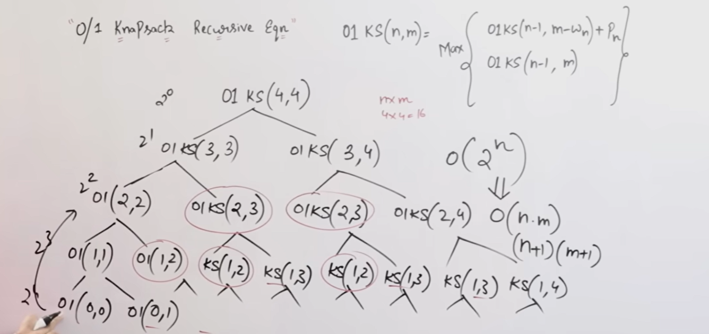

# 🎒 0/1 Knapsack Problem

**Dynamic Programming | Recursive Equation | Recursion Tree | Time Complexity**

---

## 1️⃣ What is the 0/1 Knapsack Problem?

You are given:

* `n` items
* Each item has:

  * **Weight** ( w_i )
  * **Profit** ( p_i )
* Knapsack capacity = ( W )

### Constraint (very important):

Each item can be:

* **Taken completely (1)**
* **Not taken (0)**

❌ No partial selection

---

### 🎯 Objective

\[
\text{Maximize total profit such that total weight} \le W
\]

---

## 2️⃣ Why Dynamic Programming is Needed?

* Greedy fails ❌ (local choice ≠ global optimum)
* Brute force tries **all combinations** → too slow
* DP guarantees **optimal solution efficiently**

---

## 3️⃣ State Definition (Core DP Idea)

Let:
\[
K(n, W) = \text{Maximum profit using first } n \text{ items and capacity } W
\]

This is the **DP state**.

---

## 4️⃣ Recursive Equation of 0/1 Knapsack (VERY IMPORTANT)

For the (n^{th}) item:

---

### 🔹 Case 1: Item does NOT fit

\[
\text{If } w_n > W
\]
\[
K(n, W) = K(n-1, W)
\]

---

### 🔹 Case 2: Item fits

We have **two choices**:

1. **Exclude the item**
   \[
   K(n-1, W)
   \]

2. **Include the item**
   \[
   p_n + K(n-1, W - w_n)
   \]

Take the **maximum**:

\[
K(n, W) = \max \Big( K(n-1, W),; p_n + K(n-1, W - w_n) \Big)
\]

---

### 🔹 Base Case

\[
K(0, W) = 0 \quad \text{or} \quad K(n, 0) = 0
\]

---

## 5️⃣ Complete Recursive Formula (Exam Ready)

\[
K(n, W) =
\begin{cases}
0 & \text{if } n = 0 \text{ or } W = 0 \
K(n-1, W) & \text{if } w_n > W \
\max{K(n-1, W),; p_n + K(n-1, W-w_n)} & \text{if } w_n \le W
\end{cases}
\]

---

## 6️⃣ Recursion Tree Explanation

### What happens in recursion?

At each item:

* You **include it**
* OR **exclude it**

So each node splits into **two branches**.

---

### Example (3 items)

```
                K(3, W)
               /        \
        K(2, W)      K(2, W-w3)
          /   \          /   \
     K(1, W) K(1, W-w2) ...
```

👉 Same subproblems like `K(1, W)` appear **multiple times**
👉 This is **overlapping subproblems**

---

## 7️⃣ Time Complexity Using Recursion Tree

### 🔴 Naive Recursive Solution (Without DP)

* Each item has **2 choices**
* Recursion tree height = ( n )
* Total nodes ≈ ( 2^n )

\[
\boxed{\text{Time Complexity} = O(2^n)}
\]

❌ **Exponential time**
❌ Very slow for large `n`

---

## 8️⃣ Why Dynamic Programming is Better

DP **stores results** of subproblems so each state is solved **once**.

Number of unique states:
\[
n \times W
\]

---

### 🟢 DP Time Complexity

\[
\boxed{O(nW)}
\]

### 🟢 DP Space Complexity

\[
O(nW)
\]

---

## 9️⃣ Recursion vs Dynamic Programming (Quick Table)

| Approach            | Time Complexity | Efficient? |
| ------------------- | --------------- | ---------- |
| Naive recursion     | (O(2^n))        | ❌ No       |
| Dynamic Programming | (O(nW))         | ✅ Yes      |

---

## 🔟 Why 0/1 Knapsack is a DP Problem

✔ Optimal substructure
✔ Overlapping subproblems
✔ Greedy fails
✔ Recursion tree explodes exponentially

👉 **Perfect candidate for Dynamic Programming**

---

## 🧠 One-Line Exam Answers

* **Recursive nature**:

  > Each item has two choices: include or exclude.

* **Why greedy fails**:

  > Local decisions may block optimal combinations.

* **Why DP works**:

  > DP avoids recomputation by storing overlapping subproblems.

---

## 🔑 Memory Trick (Never Forget)

* **0/1 Knapsack** → Binary choice → Recursion tree → DP
* **Fractional Knapsack** → Greedy works
* **0/1 Knapsack** → Greedy fails

---

## ✅ Final Conclusion (Perfect Ending Line)

> The 0/1 Knapsack problem has an exponential recursive solution due to its binary decision structure. Dynamic Programming optimizes this by exploiting overlapping subproblems, reducing the time complexity from (O(2^n)) to (O(nW)).


---
---
---
---


# 🎒 0/1 Knapsack Problem

**Step-by-Step Derivation of Recursive Equation**

---

## STEP 1️⃣ Understand the Problem in Plain Words

You are given:

* `n` items
* Each item has:

  * weight ( w_i )
  * profit ( p_i )
* Knapsack capacity ( W )

### Rule (0/1 condition):

Each item can be:

* taken **once (1)**
* or **not taken (0)**

❌ You **cannot break** an item.

---

## STEP 2️⃣ Decide What You Want to Compute (State Definition)

We must clearly define **what our function returns**.

Let:
\[
K(n, W)
\]

### Meaning:

> **Maximum profit that can be obtained using the first `n` items when the knapsack capacity is `W`.**

This is the **most important step** in DP.

---

## STEP 3️⃣ Identify the Base Cases (Smallest Problems)

We ask:
👉 When is the answer **obviously 0**?

### Case 1: No items

If there are no items to choose from:
\[
K(0, W) = 0
\]

### Case 2: No capacity

If the knapsack has zero capacity:
\[
K(n, 0) = 0
\]

📌 These stop the recursion.

---

## STEP 4️⃣ Focus on the Current Item (Key Thinking Step)

Now consider the **nth item**:

* Weight = ( w_n )
* Profit = ( p_n )

At this point, **only two logical choices exist**:

1. **Exclude the nth item**
2. **Include the nth item**

There is **no third option** (because of 0/1 constraint).

---

## STEP 5️⃣ Case Analysis Based on Weight

### 🔹 Case 1: Item is TOO HEAVY

If the item cannot fit:
\[
w_n > W
\]

Then inclusion is impossible.

👉 Only choice:

* **Exclude the item**

So the profit remains what we got from previous items:
\[
K(n, W) = K(n-1, W)
\]

✔ This equation is forced
✔ No comparison needed

---

## STEP 6️⃣ Case 2: Item CAN FIT

If:
\[
w_n \le W
\]

Now we truly have **two choices**.

---

### 🔹 Choice 1: Exclude the nth Item

* Ignore the item
* Capacity stays the same
* Profit comes from previous items

\[
\text{Profit} = K(n-1, W)
\]

---

### 🔹 Choice 2: Include the nth Item

If we include the item:

* We **gain profit** ( p_n )
* Capacity **reduces** by ( w_n )
* Remaining problem uses first ( n-1 ) items

So profit becomes:
\[
\text{Profit} = p_n + K(n-1, W - w_n)
\]

---

## STEP 7️⃣ Choose the Better of the Two Choices

Since our goal is to **maximize profit**, we select the better option:

\[
K(n, W) = \max \Big(
K(n-1, W),;
p_n + K(n-1, W - w_n)
\Big)
\]

📌 This is the **heart of 0/1 Knapsack DP**

---

## STEP 8️⃣ Combine All Cases into One Final Equation

Now we combine:

* Base cases
* Heavy item case
* Fit item case

---

## ✅ Final Recursive Equation (EXAM READY)

\[
K(n, W) =
\begin{cases}
0, & \text{if } n = 0 \text{ or } W = 0 [6pt]
K(n-1, W), & \text{if } w_n > W [6pt]
\max{K(n-1, W),; p_n + K(n-1, W-w_n)}, & \text{if } w_n \le W
\end{cases}
\]

---

## STEP 9️⃣ Why This Equation Creates a Recursion Tree

Every time:

* The item fits → **2 recursive calls**
* Include / Exclude

So the recursion tree **branches into two** at each level.

---

## STEP 🔟 Time Complexity from the Equation

* Each item → 2 choices
* Height of recursion tree = ( n )

\[
\text{Time Complexity (Recursive)} = O(2^n)
\]

❌ Too slow

---

## STEP 🔟+1️⃣ How DP Optimizes This Equation

* Many calls like (K(n-1, W)) repeat
* DP **stores results**
* Each state ( (n, W) ) computed once

\[
\text{Time Complexity (DP)} = O(nW)
\]

---

## 🧠 One-Line Logic Summary (Very Important)

* **State**: What is the maximum profit?
* **Choice**: Include or exclude
* **Constraint**: Weight ≤ capacity
* **Goal**: Maximize profit

---

## 🔑 Memory Trick to Rebuild Equation in Exam

> **If item fits → MAX(exclude, include)**
> **If item doesn’t fit → exclude only**

---

## ✅ Final Conclusion (Perfect Exam Ending)

> The recursive formulation of the 0/1 Knapsack problem arises from the binary decision of including or excluding each item. This leads to an exponential recursion tree, which Dynamic Programming optimizes by storing overlapping subproblem results.

---
---
---
---
---
---
---
---
---
---
---
---
---
---
---
---
---
---
---
---





## 1️⃣ What problem is being solved in the diagram?

It is the **0/1 Knapsack problem**, solved using **recursion**, and then optimized using **Dynamic Programming**.

### Function used:

\[
\text{01KS}(n, m)
\]

### Meaning:

> Maximum profit using **first `n` items** with **capacity `m`**

---

## 2️⃣ The Recursive Equation (Top-right of the board)

Written as:

\[
\text{01KS}(n, m) =
\max \begin{cases}
\text{01KS}(n-1, m - w_n) + p_n \
\text{01KS}(n-1, m)
\end{cases}
\]

### What this means:

For item `n`, you have **two choices**:

1. **Include item n**

   * Capacity reduces: ( m - w_n )
   * Profit increases: ( +p_n )

2. **Exclude item n**

   * Capacity stays same: ( m )
   * No profit added

We take the **maximum** of these two.

This is the **core logic** behind the tree.

---

## 3️⃣ Root of the Recursion Tree

At the top:

```
01KS(4,4)
```

### Meaning:

* 4 items available
* Knapsack capacity = 4

This is the **original problem**.

---

## 4️⃣ First Level of Expansion (Binary Choice)

From `01KS(4,4)` the tree splits into **two branches**:

```
           01KS(4,4)
           /       \
   01KS(3,3)     01KS(3,4)
```

### Why?

* **Include item 4** → capacity becomes `4 − w₄ = 3`
* **Exclude item 4** → capacity stays `4`

This is why **every node splits into two** → include / exclude.

---

## 5️⃣ Second Level (Same Logic Repeats)

From `01KS(3,3)`:

```
01KS(3,3)
   /     \
01KS(2,2)  01KS(2,3)
```

From `01KS(3,4)`:

```
01KS(3,4)
   /     \
01KS(2,3)  01KS(2,4)
```

### IMPORTANT OBSERVATION (Circled in Red)

```
01KS(2,3)
```

appears **more than once**.

👉 This is called **OVERLAPPING SUBPROBLEMS**.

---

## 6️⃣ Why Are Some Nodes Circled?

The circled nodes like:

* `01KS(2,3)`
* `01KS(1,2)`
* `01KS(0,1)`

are **repeated subproblems**.

### Meaning:

Without DP:

* The same subproblem is solved **again and again**
* This causes exponential time

With DP:

* We compute it **once**
* Store it
* Reuse it

This is the **entire motivation for Dynamic Programming**.

---

## 7️⃣ Leaf Nodes (Base Cases)

At the bottom you see nodes like:

```
01KS(0,0)
01KS(0,1)
```

### Why recursion stops here?

Because:

* `n = 0` → no items left
* OR `m = 0` → no capacity left

So:
\[
\text{01KS}(0, m) = 0
\]

These are **base cases**.

---

## 8️⃣ Why the Recursion Tree Is Exponential

Each node splits into **2 children**:

* Include
* Exclude

For `n` items:

\[
\text{Number of calls} \approx 2^n
\]

That’s why on the board:

```
O(2^n)
```

is written.

❌ This is too slow.

---

## 9️⃣ How Dynamic Programming Optimizes This Tree

On the right side of the board:

```
O(2^n)  ↓
O(n · m)
(n+1)(m+1)
```

### Why?

Because DP creates a **table**:

| Items ↓ / Capacity → | 0 | 1 | 2 | 3 | 4 |
| -------------------- | - | - | - | - | - |
| 0                    | 0 | 0 | 0 | 0 | 0 |
| 1                    |   |   |   |   |   |
| 2                    |   |   |   |   |   |
| 3                    |   |   |   |   |   |
| 4                    |   |   |   |   |   |

### Number of states:

\[
(n+1)(m+1)
\]

Each state is computed **once**.

---

## 🔟 Final Understanding of the Diagram

### What the diagram shows:

1. Recursive formulation of 0/1 Knapsack
2. Binary decision tree (include/exclude)
3. Exponential growth (O(2^n))
4. Repeated subproblems (circled)
5. Why DP is needed
6. DP reduces complexity to:
   \[
   \boxed{O(n \cdot m)}
   \]

---

## 🧠 One-Line Exam Explanation

> The recursion tree of the 0/1 Knapsack problem grows exponentially due to binary decisions at each item. Dynamic Programming optimizes this by storing overlapping subproblem results, reducing time complexity from (O(2^n)) to (O(nm)).

---

## 🔑 How to Explain This in an Exam (Perfect Flow)

1. Define `01KS(n,m)`
2. Write recursive equation
3. Draw recursion tree
4. Highlight repeated nodes
5. Explain overlapping subproblems
6. Show DP table size
7. Write final time complexity
